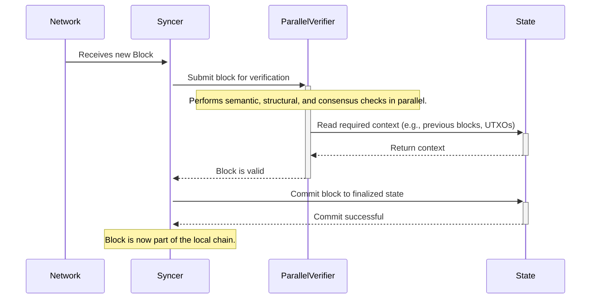

# Project Zebra Stampede Architecture Document

## Introduction / Preamble

This document outlines the technical architecture for the performance and observability enhancements for Project Zebra Stampede. Its primary goal is to provide a clear technical blueprint for instrumenting the Zebra codebase, establishing performance baselines, and guiding the implementation of code remediations. The architecture described herein is designed to be implemented within the existing modular monolith structure of the Zebra application.

## Technical Summary

To meet the product requirement of improving Zebra's performance to at least match that of `zcashd`, this architecture will focus on enhancing the system's observability. The proposed design centers on strategically embedding new metric and logging instrumentation points within the existing Rust codebase. This will be supported by a dedicated DevOps environment for long-term observation and analysis using Prometheus and Grafana. The architectural approach is one of targeted surgical enhancements to the current system, rather than a large-scale redesign, to facilitate precise bottleneck identification and validation of fixes.

## High-Level Overview

The Zebra system is a **Modular Monolith** contained within a **Monorepo**. The primary application (`zebrad`) runs as a single process composed of multiple internal library crates that handle discrete concerns such as chain data structures, networking, and state management. The primary data flow involves peer-to-peer network communication to receive blocks and transactions, which are then processed through a rigorous, parallel verification pipeline before being committed to the node's local state database.

This architectural work will **improve and extend the existing observability data flow**. The instrumented components within Zebra will export additional metrics and structured logs to an external DevOps environment for monitoring, visualization, and analysis, as required by the PRD.

## Architectural / Design Patterns Adopted

The architecture for this project will adhere to and enhance the existing patterns in the Zebra codebase, while introducing new ones to support observability.

* **Modular Monolith:** We will continue to operate within the existing modular monolith pattern. New instrumentation will be added to the relevant internal crates, respecting their established boundaries.
* **Service-Oriented (via Tower):** Zebra's components are structured as `tower` services. The new observability code will be implemented as services or layers that wrap existing services where appropriate, which is an idiomatic way to add cross-cutting concerns like instrumentation in the `tower` ecosystem.
* **Asynchronous Processing (Tokio):** All new code that involves I/O or long-running tasks must be fully asynchronous, integrating with the existing `tokio` runtime.
* **Observability:** We will introduce formal observability patterns:
    * **Metrics:** New metrics will be exposed using the existing `metrics` crate facade and `prometheus` exporter, following Prometheus best practices for naming and labeling.
    * **Structured Logging:** New logging will use the `tracing` crate, providing structured key-value pairs to allow for easier machine parsing and analysis.

## Component View

The project will primarily involve making targeted additions to the existing components. The key areas of focus are:

* **`zebrad` (Application Crate):** This is the main binary. We will modify it to initialize and configure the new DevOps observation tooling. Crucially, `zebrad` serves as the primary data source for the Z3 stack.
* **`zebra-rpc` (RPC Crate):** This is the primary interface for the `Zaino` indexer/lightwalletd-surrogate. Downstream clients, such as the `Zallet` CLI wallet, consume data *from Zaino*. Therefore, Zebra's RPC performance is a foundational dependency for the entire stack's performance, and this crate will be instrumented to measure request latency and payload sizes.
* **`zebra-consensus` / `zebra-state` / `zebra-chain` (Core Logic Crates):** These crates handle block and transaction verification and state management. They will be the primary targets for adding new, detailed metrics and logs to measure the performance of validation rules and database interactions.
* **`zebra-network` (Networking Crate):** This component manages peer-to-peer connections and message handling. It will be instrumented to provide KPIs on network health, such as peer counts and message latency.
* **DevOps Observation Environment (New External Component):** As defined in the PRD (NFR8), this externally managed component will consist of Prometheus, Grafana, and a log aggregation solution.

## Project Structure

The project is a **Monorepo** managed as a Rust workspace. The `Cargo.toml` at the root of the repository defines the member crates. The following diagram represents the high-level structure:

```plaintext
zebra/
├── book/                     # The Zebra Book (user and developer documentation)
├── docs/                     # Architectural Decision Records (ADRs)
├── grafana/                  # Grafana dashboard configurations
├── zebra-chain/              # Core data structures for the Zcash blockchain
├── zebra-consensus/          # Consensus-critical validation logic
├── zebra-network/            # Peer-to-peer networking layer
├── zebra-node-services/      # Higher-level node services (e.g., mempool)
├── zebra-rpc/                # JSON-RPC server implementation
├── zebra-state/              # Finalized chain state management
├── zebra-test/               # Shared testing utilities
├── zebrad/                   # The main application binary crate
└── ... (other support crates and configuration files)
```

### Key Directory Descriptions
* **`zebrad/`**: Contains the main application entry point (`main.rs`) and assembles all other library crates into the final, runnable `zebrad` node application.
* **`zebra-chain/`**: Defines the fundamental data structures for Zcash, such as `Block` and `Transaction`.
* **`zebra-consensus/`**: Implements the consensus-critical validation rules and is a primary target for performance instrumentation.
* **`zebra-network/`**: Manages all peer-to-peer network interactions.
* **`zebra-state`/**: Manages the storage and retrieval of the finalized blockchain state, interacting with RocksDB.
* **`zebra-rpc/`**: Implements the JSON-RPC server, providing the primary interface for external clients like `Zaino`.

## API Reference
The primary API for Zebra is the JSON-RPC interface specified in the `openapi.yaml` file in the repository root. Performance of methods like `getblock` and `getrawtransaction` are of particular interest.

## Data Models
The core data models are the Rust structs representing Zcash primitives, primarily defined in the `zebra-chain` crate. The database is a RocksDB key-value store, with data organized into column families (e.g., `hash_by_height`, `utxo_by_outpoint`, `note_commitment_tree`).

## Core Workflow / Sequence Diagrams
The most performance-critical workflow is the parallel block verification pipeline.


## Definitive Tech Stack Selections
| Category | Technology | Version / Details | Description / Purpose |
| :--- | :--- | :--- | :--- |
| **Languages** | Rust | stable (1.87.0) | Primary language for all Zebra codebase modifications. |
| **Runtime** | Tokio | Foundational | The asynchronous runtime used for all concurrent operations in Zebra. |
| **Frameworks** | Tower | Foundational | Core framework for building network services and middleware. |
| **Databases** | RocksDB | Foundational | The key-value store used for the finalized chain state. |
| **Cloud Platform** | Google Cloud Platform (GCP) | N/A | Used for CI and will host the DevOps observation environment. |
| **Testing** | Proptest, `cargo test` | Foundational | Property-based testing and the standard Rust test runner. |
| | Python | 3.x | Used for the E2E/RPC test suite. |
| **CI/CD** | GitHub Actions | N/A | The continuous integration and deployment platform. |
| **Instrumentation**| Prometheus | Client Library | The format and client library for exposing metrics. |
| | Grafana | N/A | The tool for visualizing metrics and creating dashboards. |

## Infrastructure and Deployment Overview
* **Cloud Provider(s):** Google Cloud Platform (GCP) is the primary provider for long-lived CI runners and the DevOps observation environment.
* **Infrastructure as Code (IaC):** **Terraform** will be used to define and manage the infrastructure for the observation environment.
* **Deployment Strategy:** Deployments to the observation environment may be automated using **Ansible** or a similar tool. The main application uses **GitHub Actions** for CI/CD.
* **Environments:** The project will utilize a single, dedicated **`performance-observation`** environment.
* **Rollback Strategy:** The observation environment is ephemeral and can be destroyed and rebuilt using Terraform and Ansible.

## Error Handling Strategy
The project will use the established `anyhow` and `eyre` patterns for error handling and `tracing` for structured logging.

## Coding Standards
All code must adhere to `rustfmt` and the rules defined in `clippy.toml`, enforced by the CI pipeline. Standard Rust naming conventions (`snake_case` for functions, `PascalCase` for types) must be followed.

## Overall Testing Strategy
The strategy includes Rust-based unit/integration tests (`cargo test`, `proptest`) and Python-based E2E tests (`qa/rpc-tests`), which integrate the `zcashd` RPC test suite.

## Security Best Practices
Security relies on Rust's memory safety guarantees, with `unsafe` code being strictly forbidden without review. All external inputs (P2P messages, RPC requests) must be rigorously validated.
